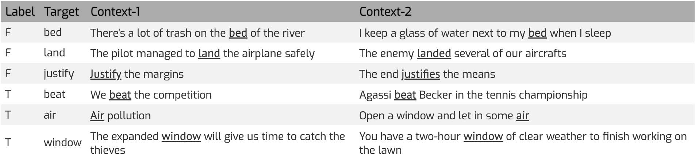
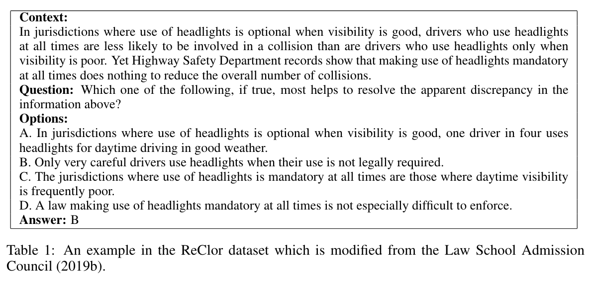

# Pyscholinguistic-Benchmark

## Stage I (from 0 - 6)
1. agent-action-object (from BLiMP)
   - Danielle visited Irene vs The eye visited Irene
2. causality_conditionality (if, because, why) (from MultiNLI)
   - "That is why icons have the power they have." contradicts "That is why God moves me."
3. one-word-understanding
   - multiple choice questions for word-level understanding

## Stage II (from 6 -12)
1. GLUE_diag
2. multilin_filtered
3. cola_filtered

## Stage III (from age 12 - adolesence and later)
1. LogiQA
   - example: \
    *Correct Answer*: a \
    *Question*: In the planning of a new district in a township, it was decided to build a special community in the southeast, northwest, centered on the citizen park.These four communities are designated as cultural area, leisure area, commercial area and administrative service area.It is known that the administrative service area is southwest of the cultural area, and the cultural area is southeast of the leisure area.
    Based on the above statement, which of the following can be derived? \
    \
    A.Civic Park is north of the administrative service area \
    B.The leisure area is southwest of the cultural area\
    C.The cultural district is in the northeast of the business district \
    D.The business district is southeast of the leisure area
1. Syllogism
   - Avicennna: Only have categorical syllogism

2. WiC: words' meanings under different contexts
   

3. ReClor: Reading Comprehension related to logical reasoning
   

4. Diffcult Words Inference

4. Verbal Reasoning
   
