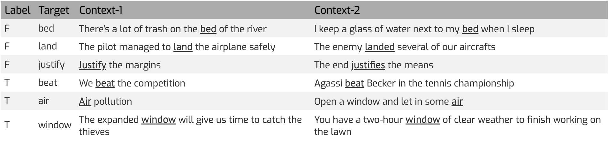
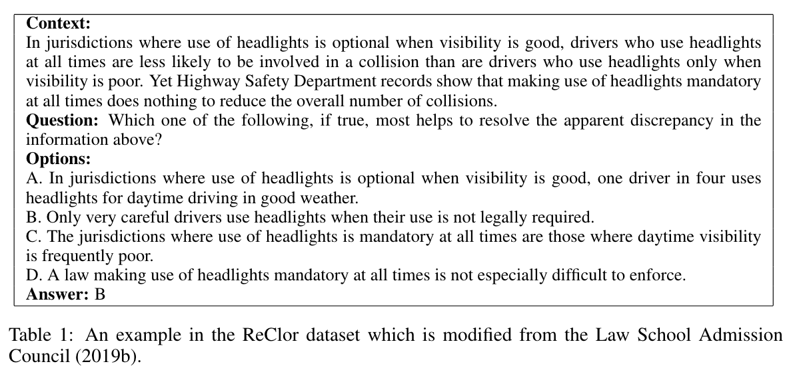

# Language Acquisition

## Stage I (from 0 - 6)
1. agent-action-object (from BLiMP)
   - Danielle visited Irene vs The eye visited Irene
2. causality_conditionality (if, because, why) (from MultiNLI)
   - "That is why icons have the power they have." contradicts "That is why God moves me."
3. one-word-understanding
   - multiple choice questions for word-level understanding

## Stage II (from 6 -12)
1. grammar-comp
- {"sentence_good": "What was Melanie going to after taking those rivers?", "sentence_bad": "What was Melanie going to those rivers after taking?", "field": "syntax", "linguistics_term": "island_effects", "UID": "adjunct_island", "simple_LM_method": true, "one_prefix_method": false, "two_prefix_method": false, "lexically_identical": true, "pairID": "9"}

2. BLiMP-comp
- {"sentence_good": "Who should Derek hug after shocking Richard?", "sentence_bad": "Who should Derek hug Richard after shocking?", "field": "syntax", "linguistics_term": "island_effects", "UID": "adjunct_island", "simple_LM_method": true, "one_prefix_method": false, "two_prefix_method": false, "lexically_identical": true, "pairID": "0"}
- From adjunct_island

2. CoLA
- 0 (not acceptable) The librarians likes books.

3. Grammar-diag
- Diagnostic-purpose

## Stage III (from age 12 and later)

1. WiC: words' meanings under different contexts
   

2. ReClor: Reading Comprehension related to logical reasoning
   

## Generation
- Prompt: You are taking a writing exam.
Write a response in which you discuss the extent to which you agree or disagree with the statement and explain your reasoning for the position you take. In developing and supporting your position, describe specific circumstances in which adopting the recommendation would or would not be advantageous and explain how these examples shape your position.
Statement: {statement}
- statement: The best way to teach is to praise positive actions and ignore negative ones.

## References

1. Williams, A., Nangia, N., & Bowman, S. R. (2018). A Broad-Coverage Challenge Corpus for Sentence Understanding through Inference. Proceedings of the 2018 Conference of the North American Chapter of the Association for Computational Linguistics: Human Language Technologies, Volume 1 (Long Papers), 1112-1122. https://aclanthology.org/N18-1101/

2. Warstadt, A., Singh, A., & Bowman, S. R. (2019). Neural Network Acceptability Judgments. Transactions of the Association for Computational Linguistics, 7, 625-641. https://doi.org/10.1162/tacl_a_00290

3. Pilehvar, M. T., & Camacho-Collados, J. (2019). WiC: the Word-in-Context Dataset for Evaluating Context-Sensitive Meaning Representations. Proceedings of the 2019 Conference of the North American Chapter of the Association for Computational Linguistics: Human Language Technologies, Volume 1 (Long and Short Papers), 1267-1273. https://aclanthology.org/N19-1128/

4. Yu, W., Jiang, Z., Dong, Y., & Feng, J. (2020). ReClor: A Reading Comprehension Dataset Requiring Logical Reasoning. International Conference on Learning Representations (ICLR). https://openreview.net/forum?id=HJgJtT4tvB